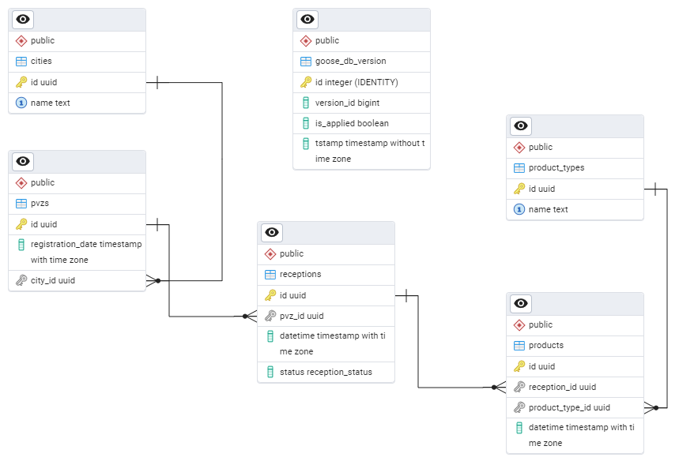

# Avito Assignment

This project is a solution to a [test task](https://github.com/avito-tech/tech-internship/tree/main/Tech%20Internships/Backend/Backend-trainee-assignment-spring-2025) for AvitoTech.

The project allows you to create order pick-up points (PVZ), its receptions, and then add products to in progress receptions.

The project consists of server serving HTTP and gRPC. It connects to PostgreSQL database to store data. Server migrates the database automatically on startup.

## Demo
You need [task](https://taskfile.dev/) and [docker](https://www.docker.com/) to try the demo. You can use commands from `Taskfile.yml` directly if you don't want to use `task`. To see all tasks, use command:
```
task --list
```

To try the demo out, run `docker compose` by using command:
```
task up
```
Containers will be created and started. To stop and remove them use command:
```
task down
```

To interact with the server, use HTTP requests. HTTP server listens on port `8080`. Endpoints:
* `/api/v1/dummyLogin`  
Returns token string needed to use other endpoints.

Token needed (Header to add: `Authorization: Bearer [token]`):
* `/api/v1/pvz`  
Creates PVZ;
* `/api/v1/pvz?startDate={startDate}&endDate={startDate}&page={page}&limit={limit}`  
Returns the *page*th page with *limit* number of PVZs with in progress reception;
* `/api/v1/receptions`  
Creates reception by *pvz_id* if PVZ doesn't have in progress reception;
* `/api/v1/pvz/{pvz_id}/close_last_reception`  
Closes reception by *pvz_id* if PVZ has in progress reception;
* `/api/v1/pvz/{pvz_id}/delete_last_product`  
Deletes last product from reception by *pvz_id* if PVZ has in progress reception;
* `/api/v1/products`  
Adds product to reception by *pvz_id* if PVZ has in progress reception.

Server can also recieve gRPC. gRPC server listens on port `3000`. Check `internal/controller/grpc/v1` directory for more info.

## Tests

Integration test creates PVZ and reception, adds 50 random products and than closes reception. To run an integration test use command:
```
task integration
```
This test creates rows in database and doesn't delete them. This is not good.

## ERD

The image below shows Entity Relationship Diagram for the database used in the project. Table `goose_db_version` is special and required for migrations.



## Decisions

1. Cities have their own table `cities`. It contains only those cities in which you can create PVZ.
2. Same idea for product types. Table `product_types` contains only those product types that can be created.
3. I decided to hand over the responsibility for generating UUIDs to the database. So, if you try to create PVZ with specific UUID, you will still get UUID generated by database.
4. Reception status has its own type `reception_status` in database.
5. For paginated query there is multicolumn index `idx_receptions_status_datetime` for faster searching.
